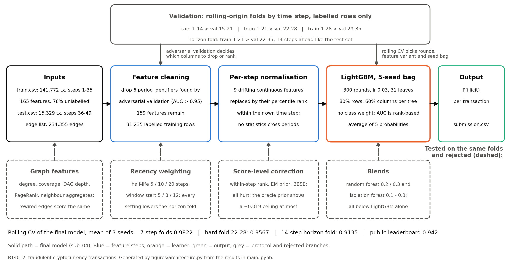
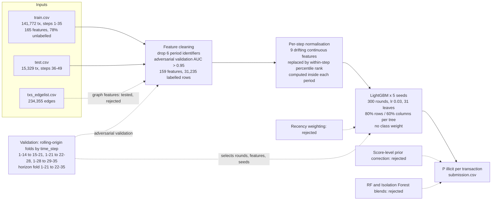

# Methodology and results — working notes for the report

Source material for the 4-page report. Numbers are copied from `results.md` and `artifacts/`;
every table can be regenerated by executing `main.ipynb`. Section numbers follow the report
brief (2.1 preprocessing and features, 2.2 model development and validation, 2.3 model
exploration and final strategy, 3 results, 4 reflection).

---

## 1. Problem and approach (for the Introduction)

The data is a graph of Bitcoin transactions: 203,769 transaction ids appear in the edge list,
234,355 directed payment-flow edges, 165 anonymised features per transaction and 49 time steps.
It is split in time: train = steps 1–35 (141,772 rows, 78% unlabelled), test = steps 36–49
(15,329 labelled rows only). Metric: ROC AUC on the pooled test ranking. Everything below is
measured on these files; no external description of the data is used as evidence.

Three properties of the data drove every decision:

1. **Edges never cross time steps**, so the train and test graphs are disconnected. No label can
   travel through the graph into the test period; graph features must be structural and
   computed inside each period.
2. **The base rate drifts hard**: the labelled fraud rate per step ranges from 0.43% to 35.97%
   (an 84× swing) within the training period alone, and the test period's rates are unknown.
3. **Only labelled test-period nodes are shipped.** Their 46,668 unlabelled neighbours exist in
   the edge list as ids only, so neighbour-feature aggregates see fewer neighbours on test than
   on train unless the train side is computed the same way.

High-level strategy: build a strong, leakage-free tabular baseline; test graph features and a
GNN against it honestly rather than assume they help; treat temporal drift as the main problem.

---

## 2.1 Data preprocessing and feature engineering

### Validation protocol (set before any modelling)

Rolling-origin folds by `time_step`, expanding window, 7-step validation blocks:
train 1–14 → val 15–21, train 1–21 → val 22–28, train 1–28 → val 29–35. Step 2 added a fourth
fold with the test set's horizon, train 1–21 → val 22–35 (14 steps ahead). Only labelled rows
enter fitting and scoring. Every number is a mean over folds and 3 seeds unless stated.
Random K-fold was ruled out because it puts future rows in the training set of past rows.

### Period identifiers: six raw features removed

Adversarial validation (a LightGBM told to separate labelled train rows from test rows) scored
AUC 1.000 on the raw features. Tested one at a time, six columns each identify the period alone
(single-feature AUC > 0.95); the next feature scores 0.935.

| feature | single-feature adversarial AUC | Spearman with time_step | share of test values outside train range |
|---|---|---|---|
| feat_101 | 0.999 | 0.997 | 99.5% |
| feat_103 | 0.998 | 0.995 | 99.4% |
| feat_100 | 0.998 | 0.992 | 99.2% |
| feat_136 | 0.996 | 0.994 | 0% |
| feat_139 | 0.977 | 0.954 | 0% |
| feat_137 | 0.941 | 0.896 | 0% |

Their per-step medians rise almost linearly with time, and all six sit in the block of columns
(94–165) whose values behave like neighbourhood summaries, so they are most plausibly aggregates
of a time-like quantity over neighbours. Whatever their construction, a tree model splits on them
to learn *when* a transaction happened; on the test period nearly every value falls in the newest
leaf. They were removed from every model (159 features remain).
Removing them costs nothing on rolling CV (0.9737 → 0.9726, within seed noise).

The cleaned set still scores 0.997 on adversarial validation, driven by `feat_2`, `feat_106`,
`feat_109`, `feat_112`: genuine drift in feature scale over time, not identifiers. Step 2
addresses these by per-step normalisation.

### Graph features (built, tested, not used in the final model)

Computed per period from `txs_edgelist.csv` (`graph_features.py`), 194 columns:

| family | columns | parity between train and test |
|---|---|---|
| topology | in/out/total degree, count and share of neighbours without a feature vector, weakly-connected component size, DAG depth and height, PageRank relative to the node's component | exact: uses all edges of the period, including nodes without features |
| aggregates | mean/max/std of the top-20 raw features (by LightGBM gain on steps 1–28) over predecessors, successors, 1-hop and 2-hop neighbourhoods, plus node-minus-neighbour deltas | on train computed twice: over all train nodes ("full") and over labelled nodes only ("lab", mirroring test) |

Verified first: all 58,437 dangling edges (an endpoint absent from both files) touch a test node,
never a train node, so "neighbours without a feature vector" means the same thing on both sides.
Component size was dropped by the same adversarial rule as the raw features: components never
span steps, so a component's size identifies its step (AV AUC 1.0 on its own).

### Missing values

None in the features. `label` is missing for 110,537 train rows (77.97%); those rows are used
to build graph neighbourhoods but never enter the loss or the metric.

---

## 2.2 Model development and validation

### Baselines on the raw features (3 folds, 3 seeds)

| model | CV AUC pooled | CV AUC per-step mean | CV PR-AUC |
|---|---|---|---|
| logistic regression (standardised, clipped ±10 sd, balanced) | 0.9033 | 0.9103 | 0.6241 |
| random forest (500 trees, balanced subsample) | 0.9651 | 0.9681 | 0.9413 |
| LightGBM, early stopping on recent 15% + `scale_pos_weight` | 0.9737 | 0.9735 | 0.9279 |

Random Forest is the strongest of the three on PR-AUC; LightGBM overtakes it on the competition
metric once configured for it (next table).

### Class imbalance and boosting rounds

ROC AUC is rank-based, so re-weighting the positive class cannot raise it; it only changes the
trees. Early stopping on the most recent 15% of a training window picks a round count for that
tail's base rate, which differs from the next period's. Holding the features fixed (cleaned raw
set):

| LightGBM configuration | CV AUC pooled | hard fold 22–28 | CV PR-AUC |
|---|---|---|---|
| early stop + pos_weight (as above) | 0.9726 | 0.9368 | 0.9316 |
| fixed 600 rounds + pos_weight | 0.9734 | 0.9304 | 0.9471 |
| fixed 600 rounds, unweighted | 0.9797 | 0.9489 | 0.9504 |
| fixed 150 / 200 / 300 / 400 rounds, unweighted | 0.9765 / 0.9806 / **0.9819** / 0.9809 | 0.9423 / 0.9527 / **0.9558** / 0.9525 | 0.9443 / 0.9485 / 0.9507 / 0.9505 |

The class weight costs ~0.006 AUC on the hard fold; 300 fixed rounds is the plateau. Other
LightGBM parameters (learning rate 0.03, 31 leaves, 80% row and 60% column subsampling) were held
at conventional values and not tuned further.

### Does the graph help? (3 folds, 3 seeds, LightGBM early-stop configuration)

| features | CV AUC pooled | CV PR-AUC |
|---|---|---|
| cleaned raw (159) | 0.9726 | 0.9316 |
| + topology (kept columns) | 0.9725 | 0.9325 |
| + aggregates (lab view) | 0.9649 | 0.9170 |
| + all graph columns (lab view) | 0.9680 | 0.9297 |
| + all graph columns (full view) | 0.9691 | 0.9233 |
| **ablation: edges randomly rewired within each step, same columns** | **0.9741** | 0.9372 |

No graph family improves the cleaned raw set; the neighbour aggregates hurt the hard fold, and
the rewired graph scores the same as the real one. On this data the topology carries no
forward-transferable signal beyond the node features. The final step-1 model uses no graph
features; the graph work is reported as an ablation.

---

## 2.3 Model exploration and final strategy (step 1)

Explored: logistic regression, random forest, LightGBM (two configurations), and LightGBM with
each graph-feature family. Selection rule set before looking at the leaderboard: best mean
pooled AUC on rolling CV among models without period identifiers.

Final step-1 model: LightGBM, 159 cleaned raw features, 300 rounds, unweighted, fitted on all
31,235 labelled rows of steps 1–35.

### Public leaderboard (30% of test, ~4,600 rows; 20 entries, top 0.9573, median 0.9494 as of 26 Sep; top 0.9636 on 27 Sep)

| submission | change being priced | CV AUC | public LB |
|---|---|---|---|
| sub_01 | cleaned raw, early stop + pos_weight | 0.9726 | 0.9390 |
| sub_02 | same, six period identifiers kept | 0.9737 | 0.9409 |
| sub_03 | cleaned raw, 300 fixed rounds, unweighted | 0.9819 | 0.9451 |

Rounds/weighting: +0.009 CV, +0.006 LB. Period identifiers: −0.001 CV, +0.002 LB (inside the
noise of ~550 public positives). CV-to-LB gap for sub_03: 0.037, attributed to the 14-step
horizon; step 2 targets it.

---

## Step 2 — temporal drift and prior shift

_Sections below are filled in from the step-2 experiments (artifacts/cv_recency*.csv,
cv_normalisation*.csv, score_correction*.csv)._

### 2.2 (cont.) Horizon fold and the pooled-vs-per-step gap

Two protocol additions. (1) A fourth fold with the test set's horizon: train 1–21 → val 22–35,
14 steps ahead, matching the 14-step distance from step 35 to step 49. It is the tie-breaker for
every step-2 decision, with a noise floor of 0.002 (three seeds). (2) The **gap** = pooled AUC −
mean of per-step AUCs, reported per fold. A negative gap means correct rankings inside each step
that interleave badly across steps; this is what the pooled competition metric penalises and
what per-step reporting alone would hide.

For the step-1 model: gap ≈ 0 at 7 steps ahead, −0.026 at 14 steps ahead (pooled 0.896 vs
per-step mean 0.922). The model's scores deflate for far-ahead steps, so far-ahead fraud is
ranked below near-term licit transactions. This single number explains most of the CV-to-
leaderboard gap and set the direction for the rest of the step.

### 2.1 (cont.) Recency weighting and training window

Hypothesis: under drift, recent steps should count more. Tested as exponential sample weights
0.5^((t_last − t)/h) with half-life h ∈ {5, 10, 20} steps, crossed with a training-window start
step ∈ {1, 5, 8, 12}; LightGBM (300 rounds, unweighted, cleaned raw features), four folds, two
seeds. Selected rows:

| window start | half-life | mean of 3 folds | hard fold 22–28 | horizon fold 22–35 |
|---|---|---|---|---|
| 1 | none (uniform) | **0.9814** | **0.9544** | **0.8941** |
| 1 | 20 | 0.9812 | 0.9537 | 0.8905 |
| 1 | 10 | 0.9816 | 0.9548 | 0.8890 |
| 1 | 5 | 0.9796 | 0.9485 | 0.8823 |
| 5 | none | 0.9802 | 0.9493 | 0.8880 |
| 8 | none | 0.9726 | 0.9341 | 0.8496 |
| 12 | none | 0.9640 | 0.9090 | 0.8155 |

Every form of down-weighting or dropping early history lowers the horizon fold, monotonically
in how much history is removed (start=12 costs 0.079). The drift is not a slow walk in which
old steps become irrelevant; early steps contain fraud patterns that still transfer, and the
labelled set is small enough (31k rows) that volume dominates. Decision: uniform weights, full
window. Artifacts: `artifacts/cv_recency.csv`, `artifacts/cv_recency_summary.csv`.

### 2.1 (cont.) Per-step feature normalisation

Motivation: the cleaned features still separate train from test (adversarial AUC 0.997) through
columns whose scale trends with time (`feat_2`, `feat_106`, `feat_109`, ...), plausibly
amounts denominated in a currency whose price rose through the period. Every test step has at
least 471 rows, so within-step statistics are stable on both sides, and the transform uses no
training-set statistics: each period is normalised against itself.

Candidates: the 12 features with single-feature adversarial AUC > 0.75 ("drifting"). Variants
(LightGBM 300 rounds, four folds, two seeds; AV = adversarial AUC after the transform):

| variant | n features | AV AUC | mean of 3 folds | hard fold 22–28 | horizon fold 22–35 | gap on horizon |
|---|---|---|---|---|---|---|
| v0 baseline, cleaned raw | 159 | 0.9966 | 0.9814 | 0.9544 | 0.8941 | −0.027 |
| v1 within-step rank **added** for drifting | 171 | 1.0000 | 0.9798 | 0.9507 | 0.8955 | −0.026 |
| **v2 within-step rank replaces drifting** | 159 | 1.0000 | 0.9807 | 0.9561 | **0.9167** | **−0.018** |
| v3 rank added for all 159 | 318 | 1.0000 | 0.9793 | 0.9513 | 0.9006 | −0.023 |
| v4 rank replaces all 159 | 159 | 1.0000 | 0.9161 | 0.8987 | 0.8352 | −0.051 |
| v5 within-step z-score added | 171 | 1.0000 | 0.9796 | 0.9508 | 0.8964 | −0.027 |
| v6 deviation from step median added | 171 | 1.0000 | 0.9802 | 0.9518 | 0.8954 | −0.027 |
| v7 six period identifiers back as step-median deviations | 165 | 0.9987 | 0.9809 | 0.9529 | 0.8902 | −0.030 |
| v8 v1 + v7 | 177 | 1.0000 | 0.9813 | 0.9560 | 0.8997 | −0.026 |

Replacing the drifting features by their within-step rank (v2) gains +0.023 on the 14-step
horizon fold and shrinks the cross-step gap by a third, with the 7-step folds unchanged.
Adding the rank next to the raw column (v1) does nothing: the trees keep using the raw scale.
Ranking every feature (v4) is destructive because ranks discard absolute magnitude, which the
fraud signal needs. The period identifiers stay out: as step-median deviations (v7) they add
nothing and lower the horizon fold.

Refinement (three seeds). Ranks of *discrete* features are themselves period identifiers: with
8 distinct values, a tied percentile rank depends on the step's composition (`feat_3_rank` is the
top adversarial column of v2). Ranking only continuous drifting features (more than 100 distinct
values) and varying the threshold:

| ranked features | k | mean of 3 folds | hard fold | horizon fold | PR-AUC |
|---|---|---|---|---|---|
| AV > 0.75 incl. discrete (v2) | 12 | 0.9808 | 0.9562 | 0.9163 | 0.9144 |
| **AV > 0.75, continuous (v2b)** | 9 | **0.9819** | **0.9563** | 0.9133 | **0.9178** |
| AV > 0.80, continuous | 6 | 0.9820 | 0.9559 | 0.9125 | 0.9181 |
| AV > 0.70, continuous | 28 | 0.9562 | 0.9080 | 0.8134 | 0.8825 |
| AV > 0.65, continuous | 47 | 0.9361 | 0.9183 | 0.8394 | 0.8664 |
| AV > 0.60, continuous | 86 | 0.9244 | 0.9010 | 0.8325 | 0.8496 |

Decision: **v2b**, rank-replace the 9 continuous drifting features (`feat_2, 106, 107, 109, 142,
115, 143, 151, 145`). It matches v2 within the noise floor on the horizon fold, is better on the
other three metrics, and does not manufacture period identifiers. The controlled pair v2 vs v2b
is uploaded as a leaderboard check. Artifacts: `artifacts/cv_normalisation*.csv`.

### 2.2 (cont.) Score-level correction: within-step ranking, EM prior estimation, BBSE

The competition pools 14 steps into one ranking, so scores must be comparable across steps.
The diagnostic compares pooled AUC with the mean of per-step AUCs (the "gap") for the step-1
model, then applies three corrections to the same validation predictions (3 seeds):

| fold | per-step mean AUC | pooled AUC (raw scores) | within-step rank | EM prior (Saerens 2002) | oracle: true per-step prior |
|---|---|---|---|---|---|
| train 1–14 → val 15–21 | 0.9932 | 0.9933 | 0.9768 | 0.9933 | 0.9935 |
| train 1–21 → val 22–28 | 0.9534 | 0.9558 | 0.9238 | 0.9316 | 0.9547 |
| train 1–28 → val 29–35 | 0.9954 | 0.9966 | 0.9760 | 0.9962 | 0.9964 |
| **train 1–21 → val 22–35 (14-step horizon)** | 0.9221 | **0.8961** | 0.8587 | 0.8911 | **0.9146** |

Findings:

- At the 7-step horizon the gap is slightly positive: scores are comparable across steps. At the
  test-like 14-step horizon the gap is −0.026: the model ranks well *inside* each step but its
  scores are systematically deflated for steps far ahead of training, so far-ahead fraud is
  ranked below near-term licit transactions.
- **Within-step ranking hurts everywhere** (−0.017 to −0.037). It forces every step onto the
  same score distribution, which is wrong when base rates differ 0.4%–36% between steps; the
  model's step-level scale does carry real information.
- **EM prior estimation hurts** (−0.005 on the horizon fold, −0.024 on the hard fold). The EM
  estimate is essentially the mean predicted probability of the step (MAE vs truth 0.022, the
  same as using the raw mean), and that mean is exactly what drift deflates. For steps 29, 31
  and 32 the true prior is 0.28 / 0.15 / 0.26 while EM gives 0.11 / 0.09 / 0.18. BBSE
  (Lipton 2018) behaves the same (MAE 0.029). Both methods assume the class-conditional feature
  distributions are unchanged (pure label shift); here the features drift too, so the assumption
  fails at exactly the horizon where correction would matter.
- The oracle (adjusting with the true per-step prior) gains +0.019 on the horizon fold and is
  neutral elsewhere. That is the ceiling for any prior-correction method, and it is not
  reachable without labels or a prior estimator that survives covariate drift.

Decision: no score-level correction in the final model. The negative gap is instead attacked at
the feature level (per-step normalisation) and by recency weighting, both of which change what
the model learns rather than re-scaling its output. Artifacts: `artifacts/score_correction.csv`,
`artifacts/score_correction_priors.csv`.

### 2.3 (cont.) Stability: seed bagging, RF blend, anomaly blend

On the v2b features (four folds, three seeds; Isolation Forest rows two seeds), from notebook §14:

| configuration | mean of 3 folds | hard fold 22–28 | horizon fold 22–35 | PR-AUC |
|---|---|---|---|---|
| single LightGBM (300 rounds) | 0.9819 | 0.9563 | 0.9133 | 0.9178 |
| **LightGBM bagged over 5 seeds** | **0.9822** | **0.9567** | **0.9135** | **0.9180** |
| random forest alone | 0.9601 | 0.8936 | 0.8134 | 0.8977 |
| rank blend LightGBM 0.8 + RF 0.2 | 0.9787 | 0.9465 | 0.8969 | 0.9137 |
| LightGBM + Isolation Forest (licit-only), w = 0.1 | 0.9785 | 0.9534 | 0.9074 | 0.8930 |
| LightGBM + Isolation Forest, w = 0.2 | 0.9578 | 0.9331 | 0.8817 | 0.6973 |
| for reference: cleaned raw (step-1 features), bagged ×5 | 0.9819 | 0.9555 | 0.8966 | 0.9155 |
| for reference: v2 (12 ranked incl. discrete), bagged ×5 | 0.9815 | 0.9575 | 0.9173 | 0.9154 |

Bagging is a small gain on every metric at no risk and is adopted. Random Forest, the strongest
baseline in the literature, is far weaker at the 14-step horizon (0.81) and drags any blend
down. The anomaly blend hurts at every weight: whatever changes after the regime shift, it is
not "anomalous" in feature space in a way a licit-only model can see. Both are negative results.

Note on v2 vs v2b: with bagging, the 12-feature variant that also ranks three discrete features
scores 0.004 higher on the horizon fold and 0.0007 lower on the 7-step folds. v2b remains the
primary on principle (its ranks cannot identify the period), and the pair is uploaded so the
leaderboard arbitrates.

### 2.3 (cont.) Final step-2 model and submissions

Final model: LightGBM, 300 rounds, unweighted, five-seed bag, on 159 features = 150 cleaned raw
columns + 9 drifting continuous columns replaced by their within-step percentile rank
(`feat_2, 106, 107, 109, 142, 115, 143, 151, 145`). No graph features, no recency weights, no
score-level correction.

### Architecture of the final model

_Vector version for the PDF: `figures/model_architecture.svg`; regenerate with
`.venv/bin/python docs/figures/architecture.py`._ The same pipeline as Mermaid, for viewers that
render it (GitHub, VS Code):

How to read it: the solid path is the model behind sub_04. Everything grey or dashed was run
on the same folds and rejected; the diagram doubles as the summary of section 2.3. Two loops feed
the pipeline from the validation block: adversarial validation decides which columns are cleaned
or normalised, and rolling CV decides the round count, the feature variant and the seed bag.

Rolling CV: three 7-step folds 0.9822, hard fold 0.9567, 14-step horizon fold 0.9135 (step-1
features with the same bagging: 0.9819 / 0.9555 / 0.8966). The horizon fold is the one that
predicts the leaderboard: step 1's single-seed model scored 0.894 there against a public LB of
0.945, while its 7-step folds sat at 0.982.

Submissions were designed as controlled pairs so the leaderboard prices each change on its own:

| file | model | pair | CV 3-fold | CV horizon |
|---|---|---|---|---|
| sub_03 (step 1) | cleaned raw, single seed | reference | 0.9819 | 0.8941 |
| sub_06 | cleaned raw, bagged ×5 | bagging alone (vs sub_03) | 0.9819 | 0.8966 |
| **sub_04** | v2b rank-normalised, bagged ×5 | normalisation (vs sub_06); **primary** | 0.9822 | 0.9135 |
| sub_05 | v2 incl. discrete ranks, bagged ×5 | discrete ranks (vs sub_04) | 0.9815 | 0.9173 |

Public LB column: see `results.md` after upload.

---

## Step 3 — LightGBM hyperparameter search, and the GNN

### 2.2 (cont.) Hyperparameter search (notebook §16)

Until this point the tree parameters were conventional defaults (31 leaves, 80% row and 60%
column subsampling, λ = 1, lr 0.03 × 300 rounds); only the round count and the class weight
had been examined. Motivation: the seed spread of 0.016 on the horizon fold suggests a
higher-variance model than necessary.

Method: random search, 40 configurations over `num_leaves` {15, 31, 63, 127},
`min_child_samples` {10, 20, 40, 80, 160}, `colsample_bytree` {0.3, 0.5, 0.6, 0.8}, `subsample`
{0.6, 0.8, 1.0}, λ {0, 1, 5, 20}, α {0, 1, 5}, lr {0.02, 0.03, 0.05} with rounds = 9 / lr. v2b
features, four folds, three seeds; ranked by the horizon fold with the 7-step mean as a guardrail
(no drop beyond 0.001). Top three confirmed with five seeds; adoption rule +0.002 on the horizon
fold without loss on the 7-step mean.

Five-seed confirmation:

| configuration | leaves | min leaf | col frac | row frac | λ / α | lr × rounds | 3-fold | hard 22–28 | horizon 22–35 | seed std (horizon) | PR-AUC |
|---|---|---|---|---|---|---|---|---|---|---|---|
| baseline (steps 1–2) | 31 | 20 | 0.6 | 0.8 | 1 / 0 | 0.03 × 300 | 0.9821 | 0.9568 | 0.9147 | 0.0041 | 0.9180 |
| **cfg11 (adopted)** | **15** | **40** | 0.6 | **1.0** | 1 / 0 | **0.05 × 180** | **0.9834** | **0.9614** | **0.9278** | 0.0042 | 0.9202 |
| cfg13 | 127 | 160 | 0.5 | 1.0 | 1 / 0 | 0.05 × 180 | 0.9832 | 0.9596 | 0.9234 | 0.0067 | 0.9205 |
| cfg03 | 31 | 10 | 0.8 | 1.0 | 5 / 1 | 0.05 × 180 | 0.9823 | 0.9595 | 0.9212 | 0.0070 | 0.9164 |

The adopted configuration improves every metric: +0.013 on the horizon fold, +0.0013 on the
7-step mean, +0.005 on the hard fold, with unchanged seed variance. Two patterns in the full
search (`artifacts/lgbm_search.csv`):

- Every configuration with heavy regularisation (λ = 20 or α = 5) or a 30% column fraction sits
  0.02–0.09 below the baseline on the horizon fold. Strong shrinkage of leaf values removes the
  minority-class signal before it can be ranked.
- All configurations above the baseline use **no row subsampling** and a faster learning rate
  with fewer rounds. Row subsampling adds variance that the temporal shift then amplifies;
  smaller trees (15 leaves) generalise further ahead than deeper ones.

**The search winner was not on a plateau.** A leaves × rounds grid around cfg11 showed the
horizon fold still rising towards fewer leaves and more rounds, so the grid was extended
(three seeds, other parameters as cfg11):

| leaves \ rounds | 180 | 270 | 400 | 600 | 900 |
|---|---|---|---|---|---|
| 3 | | 0.9279 | 0.9329 | 0.9303 | 0.9316 |
| 5 | | 0.9380 | 0.9384 | 0.9376 | 0.9397 |
| **7** | | 0.9347 | 0.9399 | **0.9415** | 0.9412 |
| 9 | | | | 0.9378 | 0.9382 |
| 11 | | | | 0.9337 | 0.9344 |
| 15 | 0.9256 | 0.9254 | | | |
| 31 | 0.9208 | 0.9133 | | | |

Five-seed confirmation of the plateau:

| configuration | 3-fold | hard 22–28 | horizon 22–35 | seed spread | PR-AUC |
|---|---|---|---|---|---|
| baseline, 31 leaves × 300 rounds at lr 0.03, row subsample 0.8 | 0.9821 | 0.9568 | 0.9147 | 0.0086 | 0.9180 |
| cfg11, 15 leaves × 180 at lr 0.05 | 0.9834 | 0.9614 | 0.9278 | 0.0112 | 0.9202 |
| 7 leaves × 400 | 0.9846 | 0.9651 | 0.9396 | 0.0062 | 0.9240 |
| **7 leaves × 600 (adopted)** | **0.9854** | **0.9675** | **0.9420** | 0.0078 | **0.9262** |
| 7 leaves × 900 | 0.9854 | 0.9679 | 0.9419 | 0.0070 | 0.9269 |

The optimum is much shallower than the default: trees with 7 leaves (depth about 3) boosted for
600 rounds beat 31-leaf trees on every fold, and the margin grows with the horizon (+0.003 on the
7-step folds, +0.011 on the hard fold, +0.027 at 14 steps ahead). Interpretation: high-order
feature interactions learned by deep trees are specific to the training period and do not
transfer; low-order structure does. This is the same lesson as the negative results for
neighbour aggregates and recency weighting, seen from the model side: under drift, capacity
that fits the period is capacity that fails ahead of it. Rounds beyond 600 add nothing, and
9 or 11 leaves are already worse.

Final tuned model: LightGBM, 7 leaves, minimum 40 rows per leaf, 60% columns per tree, all
rows, λ = 1, lr 0.05 × 600 rounds, five-seed bag, v2b features → **sub_07**. As a five-seed bag
on the same folds (notebook §16b, three outer seeds): 3-fold 0.9852, hard fold 0.9668, horizon
fold 0.9405, PR-AUC 0.9258, against 0.9822 / 0.9567 / 0.9135 / 0.9180 for sub_04. Its ranking
correlates 0.955 with sub_04's, less than any previous pair, so this is the first change large
enough that the leaderboard should be able to see it. Artifacts: `artifacts/lgbm_search*.csv`.

### 2.2 (cont.) Are the horizon-fold gains specific to one window? (robustness check)

Every step-2 and step-3 decision used one horizon fold (train 1–21 → val 22–35). To rule out
selection on a single slice of history, the four key models were re-evaluated on eight windows
whose validation block lies 8–14 steps past the end of training (three seeds, pooled AUC):

| window | raw, default trees | v2b, default trees (sub_04) | raw, tuned trees | v2b, tuned trees (sub_07) |
|---|---|---|---|---|
| train 1–7 → val 8–21 | 0.9936 | 0.9769 | 0.9936 | 0.9780 |
| train 1–7 → val 15–21 | 0.9897 | 0.9684 | 0.9902 | 0.9712 |
| train 1–10 → val 18–24 | 0.9366 | 0.9413 | 0.9330 | 0.9525 |
| train 1–14 → val 15–28 | 0.9619 | 0.9656 | 0.9569 | 0.9765 |
| train 1–14 → val 22–28 | 0.9261 | 0.9373 | 0.9096 | 0.9608 |
| train 1–17 → val 25–31 | 0.8546 | 0.8980 | 0.8795 | 0.9341 |
| train 1–21 → val 22–35 | 0.8961 | 0.9133 | 0.8919 | 0.9415 |
| train 1–21 → val 29–35 | 0.8367 | 0.8723 | 0.8390 | 0.9163 |
| **mean** | 0.9244 | 0.9341 | 0.9242 | **0.9539** |
| **worst window** | 0.8367 | 0.8723 | 0.8390 | **0.9163** |

The tuned v2b model wins on six of eight windows, by 0.03–0.08 on the hard ones, and raises the
worst case by 0.08. On the two windows trained on only seven steps it trails the raw model by
0.015, where the within-step ranks have too few training periods to be learned. Two further
observations: the tuning helps only in combination with the normalised features (tuned trees on
raw features are no better than default trees), and the improvements are largest exactly where
the baseline is weakest. The gains are therefore a property of the model, not of the fold they
were selected on. Artifact: `artifacts/cv_far_windows.csv`.

### 3 (preview). What the test period looks like from the models' side

sub_07 scored 0.9403 on the public leaderboard, 0.0017 below sub_04, despite +0.027 on the
horizon fold and consistent gains on eight far-horizon windows. All seven submissions so far lie
between 0.9390 and 0.9451, a band equal to the leaderboard's own noise (std 0.006). The test
predictions themselves explain why:

| test steps | mean predicted P(illicit), sub_07 | share of rows scored > 0.5 | for reference: labelled fraud rate, train steps 29–35 |
|---|---|---|---|
| 36–42 | 0.085 | 7.4% | 5–28% |
| 43–49 | 0.022 | 0.5% | |

From step 43 onward every model we built scores almost every transaction as licit: sub_03,
sub_04 and sub_07 agree on this (mean predicted rate 0.006–0.038 per step, against 0.027–0.139
for steps 36–42), and the change is abrupt rather than gradual. The data cannot say why: either
illicit activity really fell from step 43, or it continued in a form that looks like nothing in
steps 1–35. Raw features after step 43 are no more distinguishable from those before it than any
two adjacent periods are (adversarial AUC 0.969 against 0.957–0.983 for reference pairs), so the
inputs did not visibly change character. In either case the second half of the test set
contributes little to the pooled AUC that any model can influence, and the first half is where
all our models already agree (within-step rank correlation 0.93–0.97). That is why 0.03 of CV improvement
on historical windows moves the public score by less than its noise, and why the leaderboard is
compressed into 0.942–0.957 for all twenty entries.

Consequence for model selection: the leaderboard cannot arbitrate between our submissions; the
far-window CV table above is the evidence, and sub_07 remains the primary. Two cheap probes were
uploaded to test the one hypothesis the leaderboard *can* see: whether the post-43 scores are
merely deflated (in which case equalising step means, or ranking within steps, would raise the
pooled AUC by re-interleaving the halves) or whether they are correctly low. See the ledger.

### 2.3 (cont.) Graph neural networks under a strictly inductive protocol (`gnn.py`)

Protocol. For a fold with training steps ≤ T the training graph holds only nodes with step ≤ T
and the edges among them; the validation graph holds only the validation block's nodes. Edges
never cross steps, so the two graphs share no edge (asserted in code). Node features are the
same 159-column v2b matrix as the LightGBM, z-scored with training-node statistics. Loss is
unweighted binary cross-entropy on labelled nodes; Adam, lr 1e-3, weight decay 5e-4, hidden
width 128, dropout 0.3, full-batch, a fixed epoch count chosen on CV (100 / 200 / 400 → 200 for
both models), three seeds. The graph is the labelled-node graph (31,235 nodes, 23,900 edges),
which mirrors the test file; a second variant adds the 110,537 unlabelled train nodes as
message-passing context (141,772 nodes, 163,194 edges).

| model | 3-fold | hard 22–28 | horizon 22–35 | PR-AUC | far-window mean | far-window min |
|---|---|---|---|---|---|---|
| MLP, same width and depth, **no edges** (control) | 0.9526 | 0.9396 | 0.8832 | 0.8234 | 0.9095 | 0.8253 |
| GraphSAGE + linear skip, real edges | 0.9495 | 0.9266 | 0.8593 | 0.8118 | 0.8897 | 0.7979 |
| GraphSAGE, edges randomly rewired within step | 0.9467 | 0.9309 | 0.8683 | 0.8037 | 0.9001 | 0.8056 |
| GraphSAGE, full graph with unlabelled nodes as context | 0.9540 | 0.9306 | 0.8709 | 0.8137 | 0.8973 | 0.8114 |
| **tuned LightGBM, same features (reference)** | **0.9853** | **0.9676** | **0.9415** | **0.9260** | **0.9539** | **0.9163** |

Three comparisons, each answering one question on this data alone:

- **GNN vs MLP: does message passing help?** No. With everything else identical, adding the
  real edges lowers every metric (−0.024 on the horizon fold, −0.020 on the far-window mean).
- **Real vs rewired edges: is it the topology?** The rewired graph scores *higher* than the real
  one at the horizon (+0.009) and on the far windows (+0.010). Whatever the real edges encode
  about a period, it transfers worse than random neighbourhoods of the same degree.
- **Labelled-only vs full graph: does the parity gap matter?** Unlabelled context lifts the
  7-step folds by 0.005 and the horizon by 0.012, but the full-graph GNN still trails the
  edge-free MLP at the horizon and on the far windows.

The whole neural family sits about 0.03 below the boosted trees on the same features. The
architectures were not tuned beyond the epoch count, so the absolute gap is an upper bound on
what tuning could recover; the *ordering* MLP > GNN is the robust finding, and it agrees with
the step-1 feature ablation (rewired-edge features scored the same as real ones) from a
different direction.

Hybrids, evaluated on the same folds with the GNN outputs precomputed per fold (`gnn_cache.py`):

| hybrid | 3-fold | hard 22–28 | horizon 22–35 | PR-AUC | far-window mean | far-window min |
|---|---|---|---|---|---|---|
| GraphSAGE embeddings (64-d) appended to the LightGBM features | 0.9721 | 0.9467 | 0.8964 | 0.8904 | 0.8891 | 0.7917 |
| rank blend, 85% LightGBM + 15% GraphSAGE | 0.9838 | 0.9641 | 0.9339 | 0.9209 | 0.9497 | 0.9051 |
| reference LightGBM | 0.9853 | 0.9676 | 0.9415 | 0.9260 | 0.9539 | 0.9163 |

The embedding hybrid is the worst configuration in the project: the training rows' embeddings
come from a network that saw their labels, so the trees learn to trust them and lose 0.065 on
the far windows. The blend is a small, uniform loss. Neither carries anything from the graph
into the final model. Artifacts: `artifacts/cv_gnn_summary.csv`, `artifacts/cv_gnn.csv`,
`artifacts/probe_gnn_embed.json`, `artifacts/probe_gnn_blend.json`.

---

## 3. Results and discussion — pointers

### Public leaderboard after step 2, and what a leaderboard number can and cannot say

| submission | model | CV 3-fold | CV horizon | public LB |
|---|---|---|---|---|
| sub_03 | cleaned raw, single seed | 0.9819 | 0.8941 | 0.9451 |
| sub_06 | cleaned raw, bagged ×5 | 0.9819 | 0.8966 | 0.9437 |
| sub_04 | v2b rank-normalised, bagged ×5 (primary) | 0.9822 | 0.9135 | 0.9420 |
| sub_05 | v2 incl. discrete ranks, bagged ×5 | 0.9815 | 0.9173 | 0.9398 |

_Corrected 2026-09-27: the public scores of sub_05 and sub_06 were swapped in the ledger;
the values above are from the Kaggle API._

Against their proper controls every step-2 change moved *against* the CV prediction on the
public board: normalisation −0.0017 vs sub_06, discrete ranks −0.0022 vs sub_04, and bagging
−0.0014 vs the single-seed model, although the horizon fold predicted gains of +0.017 and
+0.004 for the first two. Each delta is small. Three measurements put them in context:

- **Seed spread.** Five seeds of the same model score 0.8927–0.9087 on the horizon fold, a spread
  of 0.016. A single-seed submission is one draw from that range; sub_03's seed 0 is below the
  five-seed average on CV, so its public score is sampling luck, not a better model.
- **Subsample noise.** The public leaderboard is 30% of the test set. Re-drawing 30% subsets of
  the horizon fold gives an AUC standard deviation of 0.006 for the same predictions.
- **The submissions are nearly the same ranking.** Spearman correlation between any two of the
  four files is 0.98–0.996.

So differences below roughly 0.008 on the public leaderboard are not readable, every step-2
delta is inside that band, and the bagged model remains the right choice for the private
leaderboard (70% of test, about half the noise). The practical rule adopted from here: decisions
are made on rolling CV with three or more seeds; the leaderboard is used to confirm direction
only. This is also why the report leads with CV tables and treats the public score as one noisy
observation.

- Report ROC AUC (competition metric) alongside PR-AUC and per-step AUC; at an 11.7% positive
  rate PR-AUC is the more informative number for investigator load.
- Figures already produced by the notebook: fraud rate per step with fold boundaries; period
  identifiers' per-step median (linear in time, shaded test period); validation AUC per time
  step for raw vs cleaned models; top-30 feature importances (graph vs raw colour-coded).
- Strengths: leakage-free protocol; every modelling choice priced on CV and, where possible,
  on the leaderboard as a controlled pair. Limitations: no model can learn patterns absent from
  the training period, and the models' predictions show a discontinuity at step 43 whose cause
  the data cannot reveal; the public LB is small.

## 4. Reflection — pointers

- Conventional imbalance handling (class weights, early stopping on a recent tail) reduced AUC
  under drift; the metric dictates the choice.
- The most informative graph result was negative and cheap to obtain (edge shuffling).
- Adversarial validation turned a vague "drift" concern into a specific list of columns.

## References

Methods used:

- Saerens, Latinne & Decaestecker 2002, Adjusting the outputs of a classifier to new a priori probabilities. https://ieeexplore.ieee.org/document/6789726
- Lipton, Wang & Smola 2018, Detecting and Correcting for Label Shift with Black Box Predictors. https://arxiv.org/abs/1802.03916

Related work consulted for context only; no statement about this dataset is taken from them:

- Weber et al. 2019, Anti-Money Laundering in Bitcoin: Experimenting with GCNs for Financial Forensics. https://arxiv.org/abs/1908.02591
- When Graph Structure Becomes a Liability: A Critical Re-Evaluation of GNNs for Bitcoin Fraud Detection under Temporal Distribution Shift (2026). https://arxiv.org/abs/2604.19514
- Elmougy & Liu 2023, Demystifying Fraudulent Transactions and Illicit Nodes in the Bitcoin Network (KDD). https://arxiv.org/abs/2306.06108
